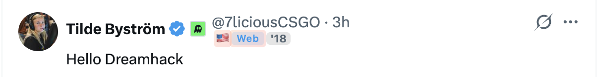
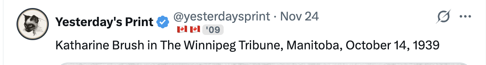
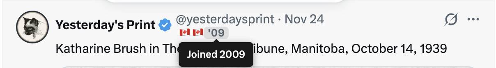
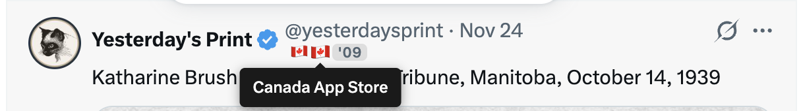
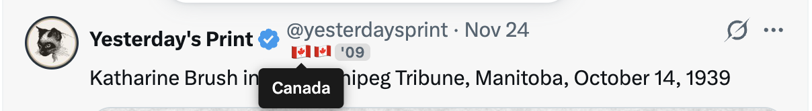

# XFlag

Display country flags next to usernames on X.com (Twitter).

## Screenshots

## Features

- Shows country flags based on user profile location
- Displays account join year
- Hover over usernames to see detailed info
- Works on feeds, search results, and profile pages
- All data cached locally - nothing sent to external servers

## Installation

### Chrome

1. Download the latest release or clone this repository
2. Open Chrome and go to `chrome://extensions/`
3. Enable "Developer mode" (toggle in top right)
4. Click "Load unpacked"
5. Select the `x-plugin` folder

### Firefox

1. Download the latest release or clone this repository
2. Open Firefox and go to `about:debugging`
3. Click "This Firefox" in the sidebar
4. Click "Load Temporary Add-on"
5. Select the `manifest.json` file from the folder

### From Stores (Coming Soon)

- Chrome Web Store: *Pending review*
- Firefox Add-ons: *Pending review*

## Usage

1. Go to [x.com](https://x.com) and log in
2. Browse any feed, search results, or profile
3. Hover over usernames to see country flags appear

## Privacy

- No data is collected or transmitted to external servers
- Profile data is cached locally in your browser
- Only reads publicly visible profile information from X.com

## License

All Rights Reserved
